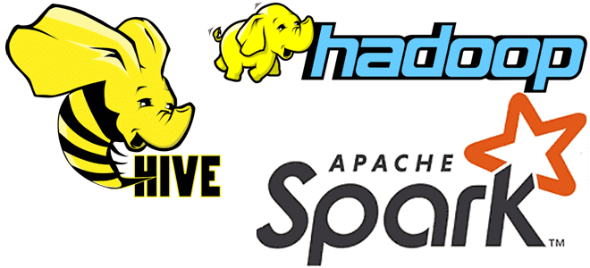

# Project with MapReduce, Spark / SparkSQL and Hive

University exam project showcasing distributed data processing with the Hadoop ecosystem.  
The repository contains multiple implementations of similar analytics tasks using:

- **Hadoop MapReduce (Streaming)**
- **Apache Spark** (RDD API)
- **SparkSQL / DataFrames**
- **Apache Hive** (HiveQL)

The focus is on comparing *different paradigms and tools* on the same type of workflow (batch analytics on structured CSV data).

## What you will find in this repo
- **MapReduce jobs** (e.g., streaming mapper/reducer scripts)
- **Spark jobs** (RDD-based processing pipelines)
- **SparkSQL jobs** (DataFrame + SQL-style transformations)
- **Hive scripts** (table definitions and queries)
- Optional helper scripts for **data loading / preprocessing**

## Typical workflow (high level)
1. Ingest CSV data (local/HDFS depending on setup)
2. Run the target implementation (MapReduce, Spark, SparkSQL, or Hive)
3. Produce aggregated results (e.g., yearly summaries and rankings)

## Technologies
- Hadoop / HDFS (environment-dependent)
- Hive / HiveQL
- Spark (PySpark)
- Python 3

## Notes
This repository is intended as an educational project for an exam: the README is kept intentionally lightweight and focuses on describing the repository contents at a high level.
